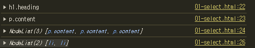
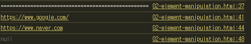
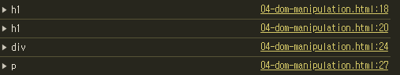
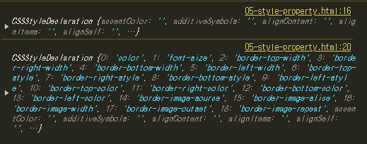
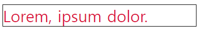

### 10/21(월) 라이브 강의

#### JavaScript
... 역사 관련

#### ECMASScript의 역사
- ECMASScript 5(ES5)에서 안정성과 생산성을 크게 높임
- ECMASScript 6(ES6)에서 객체지향 프로그래밍 언어로써 많은 발전을 이룸(이 시점이후로 JavaScript가 거의 완성된 느낌)

#### ECMASScript & JavaScipt
- JavaScipt는 ECMASScript 표준을 구현한 구체적 프로그래밍 언어
- JavaScipt는 ECMASScript 명세를 기반으로 하여 웹 브라우저나 Node.js와 같은 환경에서 실행됨


#### JavaScript 문법

##### 변수
- 변수명 작성 규칙:
    - 반드시 문자, $, _로 시작해함
    - 대소문자 구분
    - JavaScript에서의 표준
      - 카멜 케이스(camelCase) 사용:
        - 변수, 객체, 함수에 사용
      - 파스칼 케이스(PascalCase):
        - 클  래스, 생성자에 사용
      - 대문자 스네이크 케이스(SNAKE_CASE):
        - 상수에 사용
- let: 
  - 블록 스코프를 갖는 지역 변수를 선헌 
  - 재할당 가능
  - 재선언 불가느
  - ES6에서 추가됨

- const:
  - 블록 스코프를 갖는 지역 변수를 선언
  - 재할당 불가능
  - 재선언 불가능

- var: **사용X**

- let과 const의 유일한 차이는 재할당 가능임!
- const 선언시 반드시 초기값이 필요함
```js
// 오류X, undefined가 할당됨
let ssafy
// 오류O, 초기값 필요함
const ssaffy

```

##### 블록 스코프
- if, for, 함수 등의 '중괄호({}) 내부'를 가리킴
- 블록 스코프를 가지는 변수는 블록 바깥에서 접근이 불가능

###### DOM(The Document Object Model)
- 웹 페이지를 구조회된 객체로 제공하여 프로그래밍 언어가 페이지 구조에 접근할 수 있는 방법을 제공
- 문서 구조, 스타일, 내용등을 변경 할 수 있도록 함

- DOM API:
  - 다른 프로그래밍 언어가 웹 페이지에 접근 및 조작 할 수 있도록 페이지 요소들을 객체 형태로 제공, 메서드 제공

- 특징:
  - DOM에서 모든 요소, 속성, 텍스트는 하나의 객체
  - document 또한 하나의 객체임
    - ex. 콘솔창에서 `document.`등을 통해서 확인가능
    - ex. 콘솔창에서`document.title = 'SSAFY'`
  - 모두 document 객체의 하위 객체로 구성됨

- DOM tree:
  - 객체 간의 상속 구조

- DOM 핵심:
  - 문서의 요소들을 개체로 제공하여 다른 프로그래밍 언어에서 접근하고 조작할 수 있는 방법을 제공하는 API

- **DOM 선택**:
  - document.querySelector()
    - 제공한 선택자와 일치하는 element 한 개 선택
    - 첫 번째 element 객체 반환, 없으면 null
  - document.querySelectorAll():
    - 제공한 선택자와 일치하는 여러 element를 선택
    - 제공한 선택자를 만족하는 NoteList를 반환
    ```js
    console.log(document.querySelector('.heading'))
    console.log(document.querySelector('.content'))
    console.log(document.querySelectorAll('.content'))
    // ul 태그의 모든 li 자식 태그를 선택
    console.log(document.querySelectorAll('ul > li'))
    ```
    

- **DOM 조작**:
  - 클래스 속성 조작 vs 일반 속성 조작
  - classList property:
    - 요소의 클래스 목록을 DOMTokentList 형태로 반환
  
  - 1. classList 메서드
    - element.**classList.add()**:
      - 지정한 클래스추가
    - element.**classList.remove()**:
      - 지정한 클래스 값을 제거
    - element.**classList.toggle()**:
      - 클래스가 존재한다면 제거하고 false를 반환
      - 존재하지 않으면 클래스를 추가하고 true를 반환
    ```js
    console.log('==================================================')
    const h1Tag = document.querySelector('.heading')
    // 1. 클래스 속성 조작
    console.log(h1Tag.classList)
    h1Tag.classList.add('red')
    console.log(h1Tag)
    console.log(h1Tag.classList)
    
    h1Tag.classList.remove('red')
    console.log(h1Tag.classList)
    ```
        

  - 2. 일반 속성 조작 메서드
    - element.**getAttribute**(name):
      - 해당 요소에 지정된 값을 반환
    - element.**setAttribute**(name, value):
      - 지정된 요소의 속성 값을 변경
      - 속성이 이미 있으면 기존 값을 갱신, 없으면 지정된 이름과 값으로 새 속성 추가
    - element.**removeAttribute**(name)
      - 요소에서 지정된 이름을 가진 속성 제거
    ```js
    console.log('==================================================')
    // 2. 일반 속성 조작
    // a 요소 선택
    const aTag = document.querySelector('a')
    console.log(aTag.getAttribute('href'))
    // a 요소의 속성 값을 naver로 변경
    aTag.setAttribute('href', 'https://www.naver.com')
    console.log(aTag.getAttribute('href'))

    // a요소의 href 속성 값 삭제
    aTag.removeAttribute('href')
    console.log(aTag.getAttribute('href'))
    ```
    

    ```js
    const h1Tag = document.querySelector('.heading')
    console.log(h1Tag.textContent)

    h1Tag.textContent = '내용 수정'
    console.log(h1Tag.textContent)
    ```

  - 3. DOM 요소 조작 메서드
    - document.**createElement**(tagName)
      - 작성한 tagName의 HTML 요소를 생성하여 반환
    - Node.**appendChild**()
      - 한 Node를 특정 부모 Node의 자식 NodeList중 마지막 자식으로 삽입
      - 추가된 Node 객체를 반환
    - Node.**removeChild**()
      - DOM에서 자식 Node를 제거
      - 제거된 Node를 반환
    ```js
    // 생성
    const h1Tag = document.createElement('h1') 
    console.log(h1Tag)   
    h1Tag.textContent = '제목'
    console.log(h1Tag)
    // 추가
    const divTag = document.querySelector('div')
    divTag.appendChild(h1Tag)
    console.log(divTag)
    // 삭제
    const pTag = document.querySelector('p')
    console.log(pTag)
    divTag.removeChild(pTag)
    ```
    

  - 4. Style 조작
    ```js
    const pTag = document.querySelector('p')

    console.log(pTag.style)
    pTag.style.color = 'crimson'
    pTag.style.fontSize = '2rem'
    pTag.style.border = '1px solid black'
    console.log(pTag.style)
    ```

    |  | 
    | --- | --- |

  - 참고:
    - Node: DOM의 기본 구성단위
      - DOM 트리의 각 부분은 Node라는 객체로 표현됨
      - ex. Document Node, Element Node, Text Node, Attribute node
    - NodeList:
      - DOM 메서드를 사용해 선택한 Node의 목록
      - 배열과 유사, Index로만 각 항목에 접근가능
      - JS의 배열 메서드 사용가능
      - querySelectorAll()에 의해 반환되는 NodeList는 DOM의 변경사항을 실시간으로 반영하지 않음!!!!
    - Element:
      - Node의 하위 유형
      - Element는 DOM 트리에서 HTML요소를 나타내는 특별한 유형의 Node
      - ex. <p>, <div>
  
  - 세미콜론
    - 이제는 자동으로 ;을 안써도 됨(자동으로 해줌)
  
  - 호이스팅
    - 변수 선언이 끌어올려 지는 현상
    - var를 안쓰면 다 해결됨(ES6)